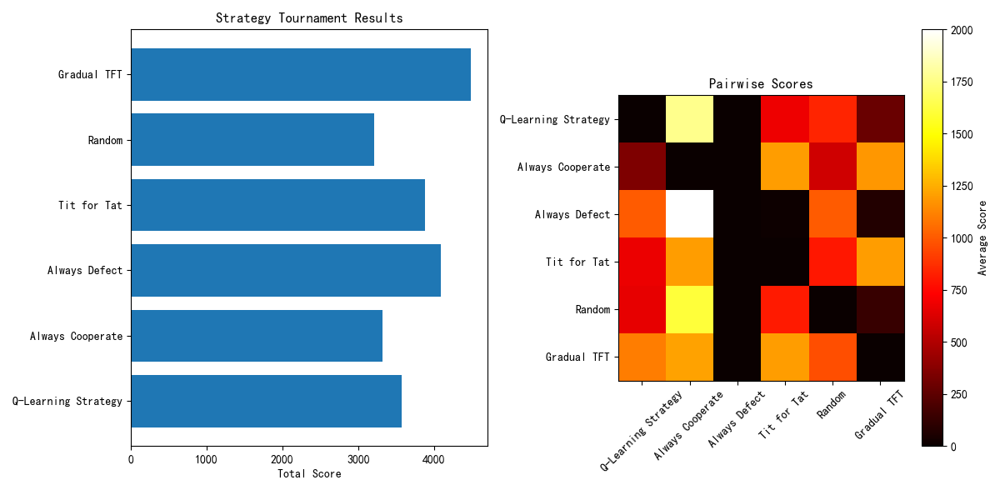

# 囚徒困境博弈平台 (Prisoner's Dilemma Platform)

<div align="center">
  
</div>

## 项目简介

这是一个囚徒困境(Prisoner's Dilemma)博弈理论研究与实验平台，基于Django框架开发，集成了多种经典博弈策略和强化学习算法。平台允许用户创建自定义策略，参与锦标赛，并分析不同策略在重复博弈中的表现。

囚徒困境是博弈论中的经典问题，探讨了个体理性与集体理性之间的矛盾。本项目不仅实现了传统的囚徒困境博弈，还融合了现代机器学习技术，尤其是强化学习算法，为这一经典问题提供了新的研究视角。

## 主要特性

- 📊 **多种经典策略**：实现了永远合作(Always Cooperate)、永远背叛(Always Defect)、一报还一报(Tit for Tat)等经典策略
- 🤖 **强化学习策略**：基于Q-learning的自适应学习策略，能够从交互中学习最优决策
- 🏆 **锦标赛系统**：支持多策略间的竞赛，自动计算得分并生成排名
- 📈 **数据可视化**：直观展示锦标赛结果和学习曲线
- 🔧 **策略编辑器**：支持在线创建和编辑自定义策略
- 🌐 **Web界面**：用户友好的界面，便于交互和实验

## 技术栈

- **后端**：Django + Django REST Framework
- **前端**：HTML/CSS/JavaScript (可能使用前端框架)
- **数据库**：SQLite (开发环境) / PostgreSQL (可选生产环境)
- **机器学习**：自定义Q-learning实现
- **数据可视化**：Matplotlib / 前端可视化库

## 安装指南

### 前提条件

- Python 3.8+
- pip (Python包管理器)
- 虚拟环境工具(可选但推荐)

### 安装步骤

1. **克隆仓库**
   ```bash
   git clone https://github.com/yourusername/prisoners_dilemma.git
   cd prisoners_dilemma
   ```

2. **创建并激活虚拟环境**
   ```bash
   python -m venv .venv
   # Windows
   .\.venv\Scripts\activate
   # Linux/MacOS
   source .venv/bin/activate
   ```

3. **安装依赖**
   ```bash
   pip install -r requirements.txt
   ```

4. **运行数据库迁移**
   ```bash
   python manage.py migrate
   ```

5. **创建超级用户**
   ```bash
   python manage.py createsuperuser
   ```

6. **运行开发服务器**
   ```bash
   python manage.py runserver
   ```

7. **访问应用**
   打开浏览器访问 http://localhost:8000

## 使用指南

### 基本博弈

- 访问主页可以看到系统内置的策略列表
- 选择两个策略进行对战，设置回合数
- 系统会模拟博弈过程并显示结果

### 创建自定义策略

1. 登录管理员账户
2. 进入"策略管理"页面
3. 点击"添加策略"
4. 输入策略名称和描述
5. 编写策略代码（Python格式）
6. 保存并测试策略

### 举办锦标赛

1. 进入"锦标赛"页面
2. 选择参赛策略
3. 设置锦标赛参数（回合数、比赛模式等）
4. 开始锦标赛并查看结果

### 使用强化学习策略

项目包含了一个基于Q-learning的强化学习策略实现。这个策略能够:

- 从与对手的交互中学习
- 记忆对手的行为模式
- 适应性地调整自己的策略
- 平衡探索与利用

详细说明请参考 [RL_README.md](RL_README.md)。

## 核心模块

- **game.py**: 囚徒困境博弈的核心逻辑
- **rl_strategy.py**: 强化学习策略实现
- **axelrod_tournament.py**: 锦标赛系统
- **dilemma_game/**: Django应用核心代码
  - **models.py**: 数据模型定义
  - **views.py**: 视图和API端点
  - **strategies.py**: 策略实现集合

## 项目结构

```
prisoners_dilemma/
├── dilemma_game/           # Django应用目录
│   ├── migrations/         # 数据库迁移文件
│   ├── templates/          # HTML模板
│   ├── admin.py            # 管理界面配置
│   ├── models.py           # 数据模型
│   ├── serializers.py      # API序列化器
│   ├── services.py         # 业务逻辑服务
│   ├── strategies.py       # 策略实现
│   ├── urls.py             # URL路由
│   └── views.py            # 视图和控制器
├── models/                 # 强化学习模型存储
├── prisoners_dilemma/      # Django项目配置
│   ├── settings.py         # 项目设置
│   ├── urls.py             # 主URL配置
│   └── wsgi.py             # WSGI配置
├── frontend/               # 前端代码(如有)
├── manage.py               # Django管理脚本
├── requirements.txt        # 项目依赖
├── game.py                 # 博弈核心逻辑
├── rl_strategy.py          # 强化学习策略
└── README.md               # 项目说明文档
```

## 贡献指南

1. Fork 项目仓库
2. 创建特性分支 (`git checkout -b feature/amazing-feature`)
3. 提交更改 (`git commit -m 'Add some amazing feature'`)
4. 推送到分支 (`git push origin feature/amazing-feature`)
5. 创建Pull Request

## 许可证

本项目采用 MIT 许可证 - 详情请查看 [LICENSE](LICENSE) 文件

## 参考资料

- [囚徒困境 - 维基百科](https://zh.wikipedia.org/wiki/%E5%9B%9A%E5%BE%92%E5%9B%B0%E5%A2%83)
- Axelrod, R. (1984). The Evolution of Cooperation. Basic Books.
- Sutton, R. S., & Barto, A. G. (2018). Reinforcement Learning: An Introduction. MIT press.

 
